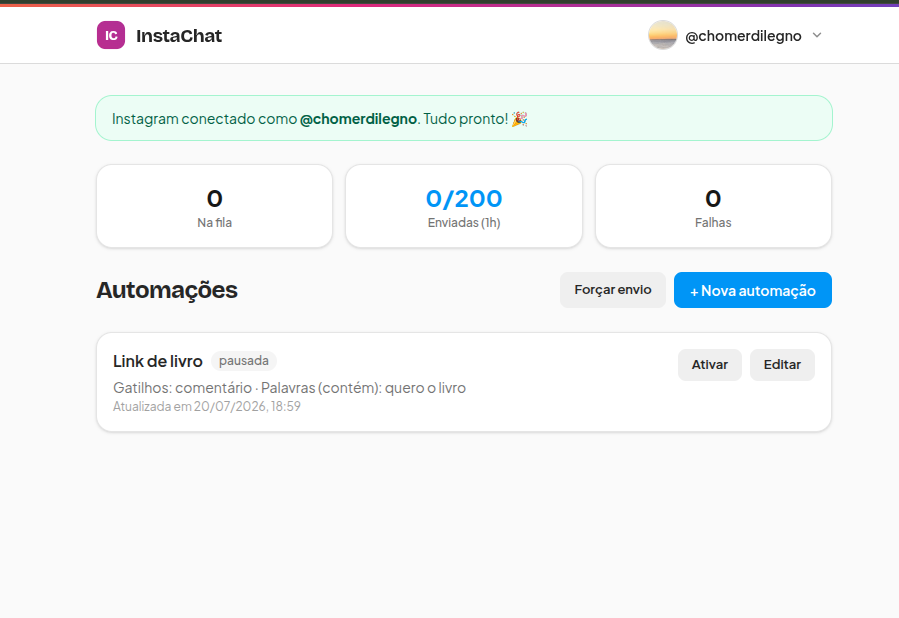
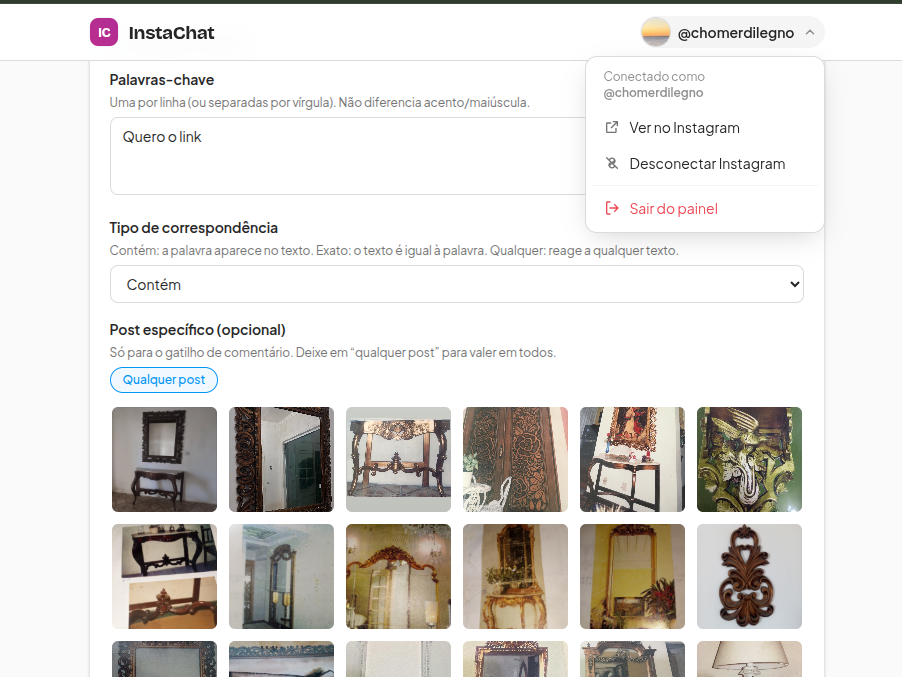
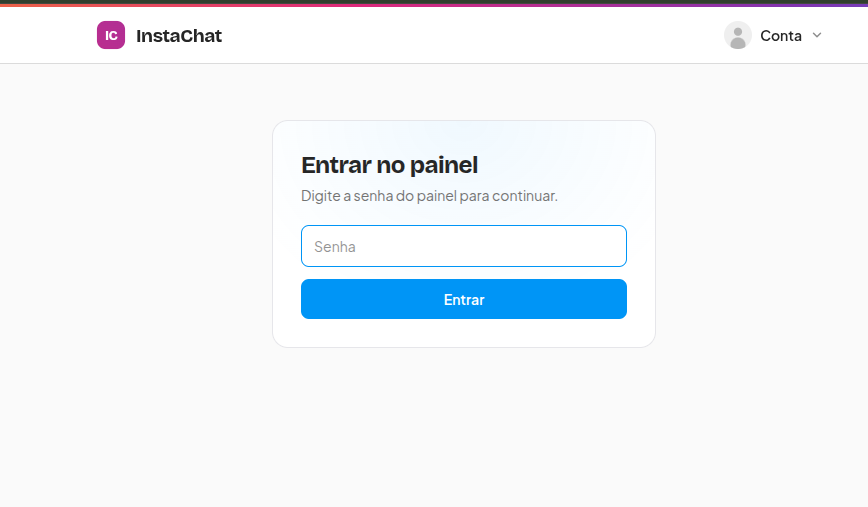
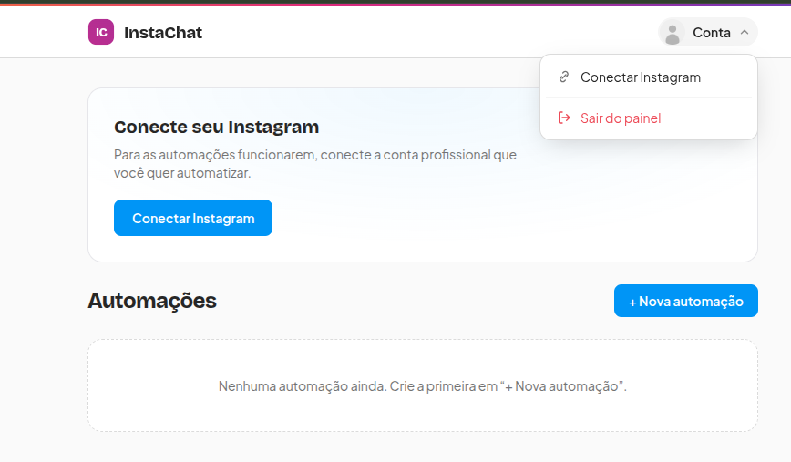
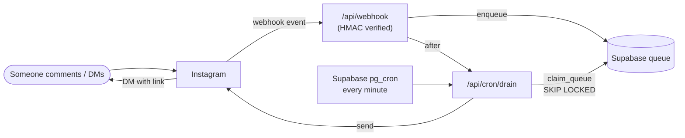

# InstaChat

[](README.md)
[](README.pt-BR.md)
[](#-translations)

[](LICENSE)


A self-hosted, **no-monthly-cost** alternative to ManyChat for Instagram DM
automation. When someone **comments a keyword** on your post/reel or **replies
to your story**, they automatically receive a **DM with your link**.

Built to run entirely on **free tiers** (Supabase + Vercel + a Meta Developer
app in dev mode). You host your own copy and connect your own Instagram account.

> **Single-tenant by design.** Each person runs their **own copy** and connects
> **one** Instagram account. That means **every user creates their own Meta
> Developer app** (with their own Facebook login used only to access
> [developers.facebook.com](https://developers.facebook.com)). The upside: **no
> Facebook Page and no Meta App Review** are required — you're just the tester of
> your own app, which keeps it free. Letting *other* people connect their
> Instagram to a single shared app would require Meta **App Review + Business
> Verification** (a different, much heavier setup — not what this project does).

> **License:** MIT — free to use, copy, modify and distribute.

---

## Features

- Comment keyword → **private reply** (bypasses the 24‑hour messaging window).
- Optional randomized **public reply** on the comment.
- **Story reply** and **direct DM** triggers.
- Quick‑reply button that opens the 24h window and unlocks **follow‑ups**
  (link DM + a **timed reminder**).
- Visual **post picker** (scope an automation to a single post).
- Atomic send **queue** (`FOR UPDATE SKIP LOCKED`) — never sends twice — with
  rate limits (~2/sec, ~200 DMs/hour).
- Password‑protected admin **panel** to create/manage automations.

## 📸 Screenshots

Running, connected to a real Instagram account.

| Panel connected (queue + hourly limits) | Automation editor + visual post picker |
| :---: | :---: |
|  |  |
| **Password-protected login** | **Account menu** |
|  |  |

## How it works

A webhook ingests `comments`/`messages` events and validates the
`X-Hub-Signature-256` HMAC over the raw body. Matches are enqueued; a worker
drains the queue and sends via the **Instagram API with Instagram Login**
(`graph.instagram.com`, v25.0 — **no Facebook Page required**).

Since Vercel's free tier has no minute‑level cron, **Supabase `pg_cron` +
`pg_net`** hit the drain endpoint every minute and refresh the 60‑day token
weekly. The webhook also triggers a drain via Next.js `after()` for near‑instant
sends.



## Tech stack

- **Next.js 16** (App Router, TypeScript) + Tailwind, deployed on **Vercel**
- **Supabase** (Postgres) — server‑only access with the service‑role key; RLS
  enabled with no policies
- **Node.js 22+**

---

## Self‑host setup

### 0. Prerequisites

- Node.js **22+** and Git
- A **professional** Instagram account (Business or Creator)
- Free accounts: **Supabase**, **Vercel**, **Meta for Developers** (needs a
  Facebook account to sign in to the developer portal)

### 1. Clone & install

```bash
git clone https://github.com/Chutzpah-Clickesef/instachat.git
cd instachat
npm install
cp .env.example .env.local   # fill values as you go
```

### 2. Database (Supabase)

1. Create a project at [supabase.com](https://supabase.com). You can disable
   "Automatically expose new tables" — the schema grants access to
   `service_role` explicitly.
2. Open **SQL Editor** and run [`supabase/schema.sql`](supabase/schema.sql).
3. Copy your **Project URL** and **service_role key** (Settings → API) into
   `.env.local` as `SUPABASE_URL` and `SUPABASE_SERVICE_ROLE_KEY`.

### 3. Environment variables

See [`.env.example`](.env.example) for the full list. Generate the secrets:

```bash
# WEBHOOK_VERIFY_TOKEN
node -e "console.log(require('crypto').randomBytes(16).toString('hex'))"
# CRON_SECRET
node -e "console.log(require('crypto').randomBytes(24).toString('hex'))"
```

### 4. Deploy to Vercel

[](https://vercel.com/new/clone?repository-url=https%3A%2F%2Fgithub.com%2FChutzpah-Clickesef%2Finstachat&env=SUPABASE_URL,SUPABASE_SERVICE_ROLE_KEY,INSTAGRAM_APP_ID,INSTAGRAM_APP_SECRET,WEBHOOK_VERIFY_TOKEN,CRON_SECRET,APP_URL,PANEL_PASSWORD)

After the first deploy, set `APP_URL` to your production URL
(e.g. `https://your-app.vercel.app`, no trailing slash) and redeploy.

> **Vercel is not required.** InstaChat is a standard Next.js app — it runs on
> any host that gives you a **public, always‑on HTTPS URL** (needed so Instagram
> can reach the webhook and OAuth callback). Alternatives: **Railway**,
> **Render**, **Fly.io**, **Netlify**, or your own **VPS**
> (`npm run build && npm start` behind nginx/Caddy). For local testing only, run
> `npm run dev` and expose it with a tunnel like **ngrok** (`ngrok http 3000`) —
> good for trying it out, but the tunnel lives only while your machine is on.

### 5. Meta app (Instagram API with Instagram Login)

1. At [developers.facebook.com](https://developers.facebook.com), create an app
   (**Business** type) and add the **Instagram** product →
   *Set up Instagram API with Instagram login*.
2. Copy the **Instagram App ID** and **App Secret** into Vercel as
   `INSTAGRAM_APP_ID` and `INSTAGRAM_APP_SECRET`; redeploy.
3. **OAuth redirect URI:** `https://YOUR_APP/api/oauth/callback`
4. **Webhook:** callback URL `https://YOUR_APP/api/webhook`, verify token =
   your `WEBHOOK_VERIFY_TOKEN`, subscribe to `comments` and `messages`.
5. Add your Instagram username as a **tester** (App roles) and accept the invite
   in the Instagram app (Settings → Apps and websites → Tester invites).
6. Add the privacy URLs in **App Settings → Basic**:
   `https://YOUR_APP/privacidade` and `https://YOUR_APP/exclusao-de-dados`,
   then **publish the app (Live)** — in dev mode the webhook does not deliver.

### 6. The free "clock" (pg_cron)

Edit [`supabase/cron.sql`](supabase/cron.sql), replacing `__APP_URL__` and
`__CRON_SECRET__`, then run it in the Supabase SQL Editor. This drains the queue
every minute and refreshes the token weekly.

### 7. Connect & test

Open `/painel`, click **Connect Instagram**, authorize, and create an
automation. Comment your keyword from another account and watch the DM go out.

---

## Troubleshooting (common pitfalls)

Hit a wall during setup? These are the exact issues you're most likely to run
into (a full step-by-step walkthrough is in
[README.pt-BR.md](README.pt-BR.md#-passo-a-passo-completo-com-erros-comuns)):

- **App name rejected on Meta** — the name **can't contain** "Instagram",
  "Insta", "IG", "Facebook" or "Meta". Use a neutral name.
- **`permission denied for table ...` (Supabase)** — the `schema.sql` grants
  access to `service_role`; re-run the `GRANT ... TO service_role` statements
  (needed because "expose new tables" is off).
- **`@supabase/supabase-js` — "native WebSocket not found"** — you're on
  **Node < 22**. Use Node 22+ locally and on your host.
- **Env var change didn't take effect** — Vercel env changes require a
  **redeploy**.
- **`/api/oauth/start` errors / can't connect** — `INSTAGRAM_APP_ID`,
  `INSTAGRAM_APP_SECRET` or `APP_URL` missing from env (the app now shows a
  friendly notice instead of a 500).
- **Webhook verification fails** — the verify token on Meta must **exactly
  match** `WEBHOOK_VERIFY_TOKEN` in your env (and you must have redeployed).
- **"Insufficient Developer Role" when connecting** — the Instagram **tester
  invite wasn't accepted** (still "Pending"), or you're authorizing with a
  different account. Accept it at
  [instagram.com/accounts/manage_access](https://www.instagram.com/accounts/manage_access/)
  → **Tester invites**. The account must be **professional AND public**.
- **Connected, but comments don't turn into DMs** — the app must be **Live**
  (development mode does not deliver webhooks); the `comments`/`messages` fields
  must be **subscribed**; the automation must be **active**; and the comment must
  come from **another account** (your own comments are ignored).

## Real limitations (by Meta's rules)

- You **cannot** require someone to follow you before sending the link — the API
  can't verify followers. You can only ask in the message.
- You **cannot** know if the link was clicked — the reminder fires on a timer.
- **Mass‑DMing a cold audience is prohibited** and gets accounts banned. Only
  comment/story/DM‑triggered replies are supported, by design.

## Development

```bash
npm run dev        # http://localhost:3000
npm run build      # production build
npx tsc --noEmit   # type-check
```

## 🌍 Translations

Help translate this README into your language — it's quick:

1. Copy `README.md` to `README.<code>.md`, where `<code>` is the language tag
   (e.g. `README.es.md` for Spanish, `README.fr.md` for French — see
   [BCP 47](https://en.wikipedia.org/wiki/IETF_language_tag)).
2. Translate the content.
3. Add a badge for your language to the **switcher block at the top of every
   existing README** (keep the list in sync across files):

   ```md
   [](README.es.md)
   ```
4. Open a pull request. 🙌

Available now: **English**, **Português (README.pt-BR.md)**.

## License

[MIT](LICENSE)
