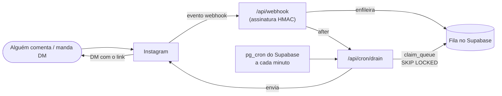

# InstaChat

[](README.md)
[](README.pt-BR.md)
[](#-tradu%C3%A7%C3%B5es)

[](LICENSE)


Uma alternativa ao ManyChat **sem mensalidade** e com o código na sua mão, para
automatizar DMs do Instagram. Quando alguém **comenta uma palavra-chave** num
post/reels ou **responde ao seu story**, a pessoa recebe automaticamente uma
**DM com o seu link**.

Feito para rodar 100% em **planos grátis** (Supabase + Vercel + um app da Meta
em modo de desenvolvimento). Você hospeda a sua própria cópia e conecta o seu
próprio Instagram.

> **É single-tenant, por design.** Cada pessoa roda a **própria cópia** e conecta
> **uma** conta do Instagram. Ou seja, **cada usuário cria o próprio app na Meta**
> (com a própria conta do Facebook, usada só para acessar o
> [developers.facebook.com](https://developers.facebook.com)). O lado bom: **não
> precisa de página do Facebook nem de App Review** da Meta — você é apenas o
> testador do seu próprio app, o que mantém tudo grátis. Permitir que *outras*
> pessoas conectem o Instagram delas a um único app compartilhado exigiria
> **App Review + Verificação de Negócio** da Meta (um cenário bem mais pesado —
> não é o que este projeto faz).

> **Licença:** MIT — livre para usar, copiar, modificar e distribuir.

---

## Recursos

- Comentário com palavra-chave → **resposta privada** (fura a janela de 24h).
- **Resposta pública** opcional no comentário (sorteia entre variações).
- Gatilhos de **resposta a story** e **DM direta**.
- Botão de resposta rápida que abre a janela de 24h e libera os **follow-ups**
  (DM com o link + um **lembrete por tempo**).
- **Seletor visual de posts** (limitar uma automação a um post específico).
- **Fila** de envio com trava atômica (`FOR UPDATE SKIP LOCKED`) — nunca envia
  em dobro — com limites (~2/seg, ~200 DMs/hora).
- **Painel** de administração protegido por senha para criar e gerenciar
  automações.

## 📸 Telas

Funcionando, conectado a uma conta real do Instagram.

| Painel conectado (fila + limite por hora) | Editor de automação + seletor visual de posts |
| :---: | :---: |
|  |  |
| **Login protegido por senha** | **Menu de conta** |
|  |  |

## Como funciona

Um webhook recebe os eventos `comments`/`messages` e valida a assinatura
`X-Hub-Signature-256` (HMAC do corpo cru). Os casamentos vão para a fila; um
worker drena a fila e envia pela **API do Instagram com Login do Instagram**
(`graph.instagram.com`, v25.0 — **não precisa de página do Facebook**).

Como o plano grátis da Vercel não roda cron de minuto, o **`pg_cron` + `pg_net`
do Supabase** batem no endpoint de drenagem a cada minuto e renovam o token de
60 dias uma vez por semana. O webhook também dispara a drenagem pelo `after()`
do Next.js, para o envio parecer instantâneo.



## Tecnologias

- **Next.js 16** (App Router, TypeScript) + Tailwind, publicado na **Vercel**
- **Supabase** (Postgres) — acesso só no servidor com a service-role key; RLS
  ligado sem políticas
- **Node.js 22+**

---

## Instalação (self-host)

### 0. Pré-requisitos

- Node.js **22+** e Git
- Uma conta **profissional** do Instagram (Comercial ou Criador)
- Contas grátis: **Supabase**, **Vercel**, **Meta for Developers** (precisa de
  uma conta do Facebook para entrar no portal de desenvolvedores)

### 1. Clonar e instalar

```bash
git clone https://github.com/Chutzpah-Clickesef/instachat.git
cd instachat
npm install
cp .env.example .env.local   # preencha os valores conforme avançar
```

### 2. Banco de dados (Supabase)

1. Crie um projeto em [supabase.com](https://supabase.com). Você pode desligar
   "Automatically expose new tables" — o schema concede acesso à `service_role`
   explicitamente.
2. Abra o **SQL Editor** e rode o [`supabase/schema.sql`](supabase/schema.sql).
3. Copie a **Project URL** e a **service_role key** (Settings → API) para o
   `.env.local` como `SUPABASE_URL` e `SUPABASE_SERVICE_ROLE_KEY`.

### 3. Variáveis de ambiente

Veja a lista completa em [`.env.example`](.env.example). Gere os segredos:

```bash
# WEBHOOK_VERIFY_TOKEN
node -e "console.log(require('crypto').randomBytes(16).toString('hex'))"
# CRON_SECRET
node -e "console.log(require('crypto').randomBytes(24).toString('hex'))"
```

### 4. Publicar na Vercel

[](https://vercel.com/new/clone?repository-url=https%3A%2F%2Fgithub.com%2FChutzpah-Clickesef%2Finstachat&env=SUPABASE_URL,SUPABASE_SERVICE_ROLE_KEY,INSTAGRAM_APP_ID,INSTAGRAM_APP_SECRET,WEBHOOK_VERIFY_TOKEN,CRON_SECRET,APP_URL,PANEL_PASSWORD)

Após o primeiro deploy, defina `APP_URL` com a sua URL de produção
(ex.: `https://seu-app.vercel.app`, sem barra no final) e republique.

> **A Vercel não é obrigatória.** O InstaChat é um Next.js comum — roda em
> qualquer host que ofereça uma **URL pública, sempre ligada e com HTTPS**
> (necessária para o Instagram alcançar o webhook e o callback do OAuth).
> Alternativas: **Railway**, **Render**, **Fly.io**, **Netlify** ou seu próprio
> **VPS** (`npm run build && npm start` atrás de nginx/Caddy). Só para testar
> localmente, rode `npm run dev` e exponha com um túnel como o **ngrok**
> (`ngrok http 3000`) — ótimo para experimentar, mas o túnel só vive enquanto
> sua máquina está ligada.

### 5. App na Meta (API do Instagram com Login do Instagram)

1. Em [developers.facebook.com](https://developers.facebook.com), crie um app
   (tipo **Empresa**) e adicione o produto **Instagram** →
   *Configuração da API com login do Instagram*.
2. Copie o **ID do app do Instagram** e a **Chave secreta** para a Vercel como
   `INSTAGRAM_APP_ID` e `INSTAGRAM_APP_SECRET`; republique.
3. **URI de redirecionamento OAuth:** `https://SEU_APP/api/oauth/callback`
4. **Webhook:** URL de callback `https://SEU_APP/api/webhook`, verify token =
   seu `WEBHOOK_VERIFY_TOKEN`, e assine os campos `comments` e `messages`.
5. Adicione seu usuário do Instagram como **testador** (Funções do app) e aceite
   o convite no app do Instagram (Configurações → Apps e sites → Convites de
   testador).
6. Cadastre as URLs de privacidade em **Configurações → Básico**:
   `https://SEU_APP/privacidade` e `https://SEU_APP/exclusao-de-dados`, e então
   **publique o app (Ao vivo)** — em modo de desenvolvimento o webhook não
   entrega os eventos.

### 6. O "relógio" grátis (pg_cron)

Edite o [`supabase/cron.sql`](supabase/cron.sql), trocando `__APP_URL__` e
`__CRON_SECRET__`, e rode no SQL Editor do Supabase. Isso drena a fila a cada
minuto e renova o token semanalmente.

### 7. Conectar e testar

Abra `/painel`, clique em **Conectar Instagram**, autorize e crie uma automação.
Comente a palavra-chave de outra conta e veja a DM sair.

---

## 🧭 Passo a passo completo (com erros comuns)

Guia detalhado, na ordem real, do zero até a automação enviando DM. Onde
aparecer `SEU_APP`, troque pela sua URL de produção (ex.:
`https://seu-app.vercel.app`).

### Parte 1 — Banco (Supabase)

1. Crie uma conta e um **novo projeto** em [supabase.com](https://supabase.com)
   (região mais perto de você). Ao criar, você pode **desligar** "Automatically
   expose new tables".
2. **SQL Editor → New query** → cole e rode o
   [`supabase/schema.sql`](supabase/schema.sql). Deve dar "Success".
3. **Project Settings → API** → copie a **Project URL** e a **service_role key**.

> ⚠️ **Erro comum:** `permission denied for table ...` ao acessar o banco. É por
> causa do "expose new tables" desligado. O `schema.sql` já concede acesso à
> `service_role`; se rodou uma versão antiga, rode os `GRANT ... TO service_role`.

### Parte 2 — Código e deploy

4. `git clone` → `npm install` → `cp .env.example .env.local`. Use **Node 22+**.
5. Gere os segredos e preencha o `.env.local`:
   ```bash
   node -e "console.log(require('crypto').randomBytes(16).toString('hex'))" # WEBHOOK_VERIFY_TOKEN
   node -e "console.log(require('crypto').randomBytes(24).toString('hex'))" # CRON_SECRET
   ```
6. Publique na Vercel (importando o repo do GitHub ou pelo botão de deploy).
   Cadastre as env: `SUPABASE_URL`, `SUPABASE_SERVICE_ROLE_KEY`,
   `WEBHOOK_VERIFY_TOKEN`, `CRON_SECRET`, `PANEL_PASSWORD`.
7. Após o 1º deploy, você já tem a URL. Cadastre `APP_URL=SEU_APP` e **republique**.

> ⚠️ **Erro comum:** `@supabase/supabase-js` quebra com "native WebSocket not
> found" → você está em **Node < 22**. Use Node 22+ (localmente e na Vercel).
> ⚠️ **Erro comum:** mudou uma env na Vercel e "não pegou"? Env só vale após um
> **Redeploy**.

### Parte 3 — App na Meta

8. Em [developers.facebook.com](https://developers.facebook.com), **Criar
   aplicativo** → tipo **Empresa**.

> ⚠️ **Erro comum:** o nome do app é **recusado**. Ele **não pode conter**
> "Instagram", "Insta", "IG", "Facebook", "Meta". Use um nome neutro
> (ex.: "Minha Empresa Chat").

9. No painel do app → **Produtos disponíveis** → **Instagram → Configurar** →
   **"Configuração da API com login do Instagram"**.
10. Anote o **ID do app do Instagram** e a **Chave secreta do app do Instagram**
    (não confunda com o *ID do app do Facebook* lá no topo — não é esse).
    Cadastre na Vercel como `INSTAGRAM_APP_ID` e `INSTAGRAM_APP_SECRET` e
    **republique**.
11. **Seção "Configure o login da empresa no Instagram" → Configurar** →
    em **URI de redirecionamento** coloque exatamente:
    `SEU_APP/api/oauth/callback` → **Salvar**.
12. **Seção "Configure webhooks":**
    - **URL de callback:** `SEU_APP/api/webhook`
    - **Verificar token:** o mesmo valor de `WEBHOOK_VERIFY_TOKEN` na Vercel
    - "Anexar certificado de cliente": **desligado**
    - Clique em **Verificar e salvar** → depois **assine** os campos
      **`comments`** e **`messages`** (não precisa de `live_comments`).

> ⚠️ **Erro comum:** a verificação do webhook falha. Quase sempre o **verify
> token** na Meta está diferente do `WEBHOOK_VERIFY_TOKEN` na Vercel — ou você
> mudou a env e **não republicou**.

### Parte 4 — Testador e publicação

13. **Funções (Roles)** → adicione sua conta como **Testador do Instagram**.
    Ela vai ficar **"Pendente"** até você **aceitar o convite**.
14. Aceite o convite (na conta que vai automatizar): no **navegador**, em
    [instagram.com/accounts/manage_access](https://www.instagram.com/accounts/manage_access/)
    → aba **"Convites de testador"** → **Aceitar**.

> ⚠️ **Erro comum:** ao conectar aparece **"Insufficient Developer Role"**. É
> convite de testador **não aceito** (ainda "Pendente"), ou você está
> autorizando com uma **conta diferente** da que aceitou. A conta também precisa
> ser **profissional E pública**.

15. **Configurações do app → Básico:** preencha **Política de Privacidade**
    (`SEU_APP/privacidade`) e **Exclusão de dados** (`SEU_APP/exclusao-de-dados`),
    escolha uma **categoria** e **salve**.
16. No topo, mude o **Modo do aplicativo** para **Ao vivo**.

> ⚠️ **Importante:** em **modo de desenvolvimento a Meta NÃO entrega** os eventos
> de comentário. O app **precisa estar Ao vivo** — e para publicar ela exige a
> URL de Política de Privacidade (por isso as páginas `/privacidade` e
> `/exclusao-de-dados` já vêm prontas).

### Parte 5 — Conectar, agendar e testar

17. Abra `SEU_APP/painel`, entre com a `PANEL_PASSWORD`, clique em
    **Conectar Instagram** e autorize.
18. Ligue o "relógio" grátis: edite [`supabase/cron.sql`](supabase/cron.sql)
    (troque `__APP_URL__` e `__CRON_SECRET__`) e rode no SQL Editor.
19. Crie/ative uma automação (palavra-chave, DM de boas-vindas com botão, link)
    e **comente a palavra-chave de outra conta**. Acompanhe a fila no painel.

> ⚠️ **Erro comum:** conectou mas os comentários não viram DM. Verifique: o app
> está **Ao vivo**? Os campos **comments/messages** estão **assinados**? A
> automação está **ativa** e a palavra-chave bate? O comentário veio de **outra**
> conta (o app ignora comentários da própria conta)?

## Limites reais (regras da Meta)

- **Não dá** para exigir que a pessoa te siga antes de mandar o link — a API não
  verifica seguidores. Só dá para pedir na mensagem.
- **Não dá** para saber se a pessoa clicou no link — o lembrete dispara por
  tempo.
- **Disparo em massa para base fria é proibido** e derruba a conta. Só há
  respostas acionadas por comentário/story/DM, de propósito.

## Desenvolvimento

```bash
npm run dev        # http://localhost:3000
npm run build      # build de produção
npx tsc --noEmit   # checagem de tipos
```

## 🌍 Traduções

Ajude a traduzir este README para o seu idioma — é rápido:

1. Copie o `README.md` para `README.<código>.md`, onde `<código>` é a tag do
   idioma (ex.: `README.es.md` para espanhol, `README.fr.md` para francês — veja
   [BCP 47](https://pt.wikipedia.org/wiki/Etiqueta_de_idioma_IETF)).
2. Traduza o conteúdo.
3. Adicione um badge do seu idioma no **bloco de troca de idioma no topo de
   todos os READMEs** (mantenha a lista igual em todos os arquivos):

   ```md
   [](README.es.md)
   ```
4. Abra um pull request. 🙌

Disponíveis agora: **English (README.md)**, **Português**.

## Licença

[MIT](LICENSE)
